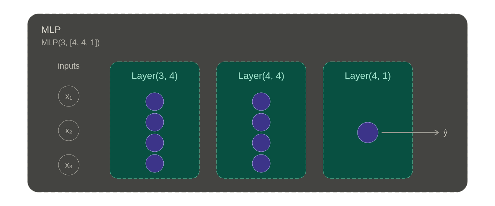
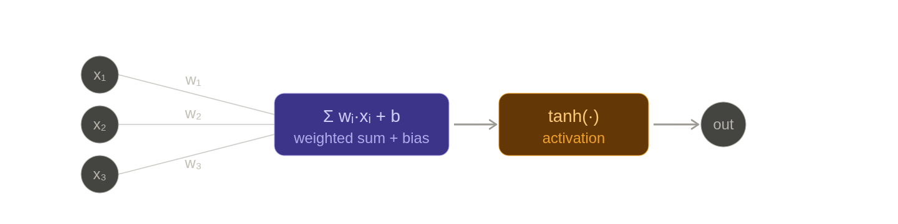

# Day 2 — Gradient Updates & `tanh`

## Q1: Why does Karpathy want `L` to go up?

**Key point:** at this moment in the video, `L` is **not** a loss yet — it's just a generic output of the computation graph.

In this part of the lecture (the first ~30 minutes), Karpathy is teaching the **geometric meaning of gradients**, not training. `L = d * f` is just the final scalar of a toy computation graph he made up. He picks "make L go up" as the demo direction purely as a **pedagogical choice**, because it makes the signs most intuitive:

$$
\frac{dL}{da}
$$

(read as: the partial derivative of the Loss with respect to $a$)

- Gradient `dL/da > 0` → "increase `a` → L goes up"
- Gradient `dL/da < 0` → "increase `a` → L goes down"

If we said "make L go down" instead, every example would require an extra sign flip in your head — easy to confuse a beginner.

### So what about later, when L becomes the loss?

In the neural-network training section, `L` is the loss function, and the goal really is to **drive it down**. At that point the update becomes:

```python
a.data -= learning_rate * a.grad
```

Notice the **minus sign** — that's where the "descent" in **gradient descent** lives:

> The gradient tells you which direction makes L go **up** → we take a step in the **opposite** direction → L goes down.

So "make L go up" and "make L go down" are mathematically the same operation, differing only by a **sign**. Karpathy first teaches you to read the "upward direction" of the gradient; once you flip the sign, that's training. **Understanding "up" first is what lets you correctly go "down" later.**

> **TL;DR:** Early in the video, `L` is not a loss — it's a teaching example. "Go up" is chosen because it makes the gradient's sign correspond to the most intuitive direction; when we later get to real training, we just flip the sign and we have gradient descent.

---

## Q2: Why update each parameter with `+= 0.01 * grad`?

```python
a.data += 0.01 * a.grad
b.data += 0.01 * b.grad
c.data += 0.01 * c.grad
f.data += 0.01 * f.grad

e = a * b
d = e + c
L = d * f

print(L.data)
```

This code shows the **most fundamental step of gradient descent: the parameter update**. The `0.01` here is what machine learning calls the **learning rate**.

### What is this line actually doing? ("The Feedback Loop")

In plain words: **"Adjust your own value according to how much you contribute to the loss $L$."**

The formula breaks into three parts:

- **`a.data`** — the current parameter value (e.g. a neural network weight $w$).
- **`a.grad`** — the $\frac{dL}{da}$ that backprop just computed. It tells you: if `a` increases a little, which direction does $L$ move (up or down)?
- **`0.01` (the learning rate)** — the step size. We can't jump too far in one step or we'll overshoot the optimum, so we take small steps.

### A vivid metaphor: walking down a mountain

Imagine you're standing on a mountain ($L$ is your altitude) and you want to reach the lowest point of the valley ($L$ minimized). You don't know where the bottom is, but you can feel the **slope** under your feet (`a.grad`).

If you sense the ground ahead is uphill (gradient is positive), then to go lower, you have to step in the **opposite** direction (downhill).

`a.data += 0.01 * a.grad` is exactly this: using the slope under your feet to decide **which way to step** and **how big a step to take** (the learning rate).

### Why loop over every parameter?

Because the final loss $L$ is **jointly determined** by $a, b, c, f$. To make $L$ smaller (or larger), every parameter has to take its share of the responsibility.

If `a.grad` is large, that means `a` has a big impact on the current loss, so we assign it a bigger adjustment — it needs to make a bigger "correction".

---

## Q3: The meaning of $e$ in the `tanh` formula

$$
\tanh x = \frac{e^x - e^{-x}}{e^x + e^{-x}}
$$

### What is $e$?

$e \approx 2.71828\ldots$, and it's defined as **the limit of a growth process**:

$$
e = \lim_{n \to \infty} \left(1 + \frac{1}{n}\right)^n
$$

**Intuitive version:** suppose you have \$1 at 100% annual interest.

- **Compounded once per year** → at year-end you have **\$2**.
- **Compounded twice per year** (more frequent) → at year-end you have **\$2.25**.
- **Compounded infinitely often** (continuous growth) → at year-end you have **$e$ dollars** (≈ **\$2.718**).

So $e$ is the **limit of continuously-compounded growth**.

### The role of $e^x$ in `tanh`

$e^x$ is the **exponential function**, and it grows extremely fast. In nature, anything whose **rate of growth is proportional to its current size** — bacterial reproduction, population growth, even neural-network weight updates — is described by $e^x$.

`tanh` uses $e^x$ to take values that would otherwise grow without bound over the entire real line and, through a ratio, **forcefully squashes them into the range −1 to +1** — making it an excellent **activation function**.

---

## Q4: The `Neuron` Class

**Reference:** [CS231n — Neural Networks Part 1](https://cs231n.github.io/neural-networks-1/)

```python
class Neuron:
  
  def __init__(self, nin):
    self.w = [Value(random.uniform(-1,1)) for _ in range(nin)]
    self.b = Value(random.uniform(-1,1))
  
  def __call__(self, x):
    # w * x + b
    act = sum((wi*xi for wi, xi in zip(self.w, x)), self.b)
    out = act.tanh()
    return out
  
  def parameters(self):
    return self.w + [self.b]

class Layer:
  
  def __init__(self, nin, nout):
    self.neurons = [Neuron(nin) for _ in range(nout)]
  
  def __call__(self, x):
    outs = [n(x) for n in self.neurons]
    return outs[0] if len(outs) == 1 else outs
  
  def parameters(self):
    return [p for neuron in self.neurons for p in neuron.parameters()]

class MLP:
  
  def __init__(self, nin, nouts):
    sz = [nin] + nouts
    self.layers = [Layer(sz[i], sz[i+1]) for i in range(len(nouts))]
  
  def __call__(self, x):
    for layer in self.layers:
      x = layer(x)
    return x
  
  def parameters(self):
    return [p for layer in self.layers for p in layer.parameters()]
```

### A three-level Russian-doll structure

This is a **three-level nesting**: **MLP → Layer → Neuron**. Each level does only two things: **hold smaller units**, and **wire up their computation**. `Neuron` is the leaf — it's the level that actually owns the trainable parameters `w` and `b`.



From the inside out:

- **`Neuron` is the leaf node**
  - On `__init__`, it randomly generates `nin` weights `w` and one bias `b`, all as `Value` objects (so they support backprop).
  - On `__call__(x)`, it computes `tanh(w·x + b)` and returns a single `Value`.
  - **Neat trick:** `sum((wi*xi for ...), self.b)` uses `sum`'s second argument as the starting value to fold the bias `b` into the sum, saving the extra "add the bias" line.

- **`Layer` is `nout` Neurons standing in a row**
  - They all share the same input vector `x`, each runs its own forward pass, and the results are gathered into a list.
  - `outs[0] if len(outs) == 1 else outs` is a bit of **syntactic sugar** — when the final layer has only one neuron, it returns a bare `Value` instead of `[Value]`, so the caller doesn't have to unwrap a single-element list.

- **`MLP` strings Layers into a chain**
  - The key trick is the single line `sz = [nin] + nouts` — prepending the input dimension to `nouts` so that `sz[i]` and `sz[i+1]` are automatically the `(nin, nout)` of the `i`-th layer.
  - Example: `MLP(3, [4, 4, 1])` → `sz = [3, 4, 4, 1]`, and the three layer shapes are automatically `(3, 4)`, `(4, 4)`, `(4, 1)`.
  - In `__call__`, `x = layer(x)` keeps overwriting `x` — **each layer's output becomes the next layer's input.**

### So what does a single Neuron actually compute inside?



Suppose you're building a self-driving vision system that has to decide whether the frame contains a **"red light"**:

- **`x`** — input feature list, e.g. `[pixel brightness, color saturation, edge sharpness]`
- **`self.weight`** — the importance the neuron has learned for each feature: `[0.1, 0.8, 0.3]` (it has discovered that "color saturation" matters most for red-light detection)
- **`self.bias`** — the neuron's threshold, e.g. `-0.5`

When you call `neuron([0.2, 0.9, 0.5])`:

1. Compute `(0.1 × 0.2) + (0.8 × 0.9) + (0.3 × 0.5) − 0.5`.
2. Feed the result into `tanh`.
3. If the output is close to `1`, the neuron is "excited" — it thinks this is a red light.

---

### 1. What is Bias? — "It sets the threshold"

If **weights** determine **how important** a signal is, then **bias** determines **how easily excited** the neuron is.

**Analogy: should I go out for boba tea?**

- $x_1$ = how hot is it outside, $w_1$ = how much you hate heat
- $x_2$ = how much you want boba, $w_2$ = how much you love boba

Decision formula:

$$
\text{Result} = (w_1 \cdot x_1 + w_2 \cdot x_2) + b
$$

| Scenario | What happens |
|----------|--------------|
| **No bias** ($b = 0$) | If $x_1 = 0$ and $x_2 = 0$, the result is exactly 0. The neuron is hard to activate — only very compelling inputs can move it. |
| **With bias** ($b = 5$) | Even if it's not hot and you don't want boba, the baseline is already 5 just because of $b$. It's like giving the neuron a built-in "default excitement". |

**The essence:** bias lets a neuron tune its own **activation threshold**. Without it, every neuron is forced to pass through the origin $(0, 0)$, which makes the network extremely inflexible.

---

### 2. Why apply `tanh` to the result? — "Soft clipping and non-linearity"

The output of the `sum` (we call this **logits**) can become very large — say `1000` or `-500`.

- **Without `tanh`:** the values grow without bound. In a multi-layer network this leads to **numerical overflow**, or the signal between layers spirals out of control.
- **With `tanh`:** it acts like a "smart compressor". No matter how extreme the input, the output is forced into the range **[−1, +1]**.

---

### 3. Why does "close to 1" count as "excited"?

This is a mathematical abstraction of biological neurons used in computer science:

| Output value | Meaning |
|--------------|---------|
| Close to **+1** | Activated / Firing |
| Close to **−1** | Inhibited |
| Close to **0**  | Hesitant / Uncertain |

In binary classification (e.g. "is this a cat or a dog?"), we typically want the neuron to output ≈ `+1` for cats and ≈ `−1` for dogs.

**Why specifically "close to 1"?** It's really an expression of **probabilistic confidence**:

- **Increased certainty:** the closer the value is to 1, the more confident the model is in "this is the correct class".
- **Gradient feedback / optimization:** during backprop, when the output is near 1, the **gradient shrinks** (`tanh` flattens at the edges), which lets the model "settle down" late in training and stops it from oscillating wildly in response to tiny input changes.

---

### Teacher's summary: bias and `tanh` are the perfect duo

- **Bias is the "baseline"** — it decides under what conditions the neuron starts to produce a signal.
- **`tanh` is the "filter"** — it decides in what shape that signal is passed to the next layer.

You can think of a neuron as a **"weighted voting machine"**:

- $w \cdot x$ — the **influence** of each voter (input).
- $b$ — the chairperson's (i.e. the neuron's) **personal stance**.
- $\tanh$ — the final **vote-counting rule**: every total has to be normalized to `[−1, +1]`, or else the tally goes haywire.
